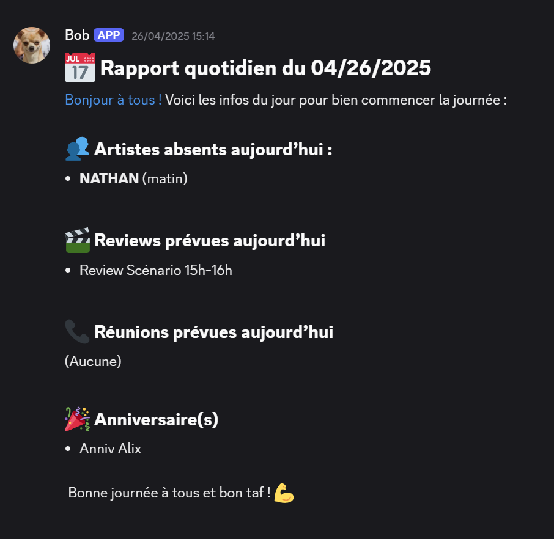

# Discord-Bot-Production

Ce projet est un bot Discord conçu pour aider à la gestion de la production de projets 3D pour mon film de fin d'étude. Il est relié a une base de donnée Google Sheets pour récupérer les informations nécessaires et les envoyer sur un serveur Discord.

## Fonctionnalités actuelles
- Envoi automatique d'un message quotidien avec les informations importantes de la journée.

## Fonctionnalités prévues
- Déclaration de l'avancement des tâches.
- Gestion des plannings et des deadlines.
- Notifications personnalisées.

## Aperçu

## Structure du projet
- `src/`
  - `main.py` : Point d'entrée du bot.
  - `bot.py` : Contient la logique principale du bot.
  - `googlesheetsclient.py` : Gère l'intégration avec Google Sheets.
  - `meme.py` : Module pour la gestion des mèmes (envois automatiques)
  - `settings.py` : Configuration du bot, a completer avec les informations de votre bot.
  - `credentials/` : Contient les fichiers d'identification nécessaires, noat

## Contribuer
Ce projet ne me sert que comme démonstration de mes compétences en Python et en développement de bots Discord. Je n'accepte donc pas de contributions pour le moment.